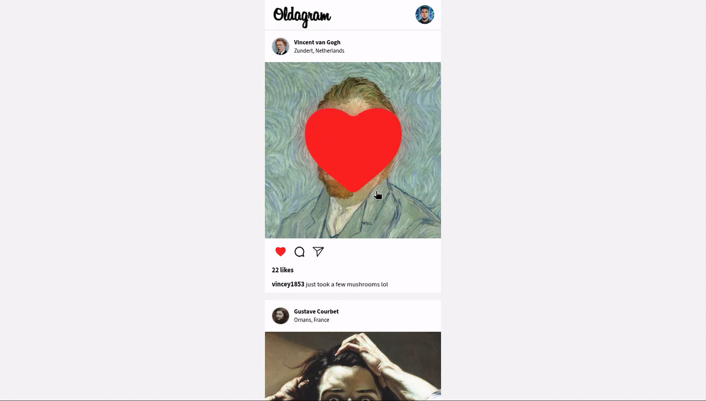

# 📸 Oldagram - Scrimba Solo Project

A mobile-first Instagram clone built with Vanilla JavaScript, HTML, and CSS. This project renders a dynamic feed of posts and features interactive "like" functionality with animations, mimicking the core experience of a social media feed.

**[🚀 View Live Demo](https://exc1d.github.io/scrimba-oldagram/)**



## ✨ Features

- **Dynamic Rendering:** Posts are generated dynamically from a JavaScript array of objects (Data-Driven UI).
- **Interactive Likes:**
  - **Double-Click:** Double-clicking a post image adds a like and triggers an Instagram-style "Heart Burst" animation.
  - **Toggle Button:** Clicking the heart icon toggles the like status (add/remove).
- **State Management:** The UI stays in sync with a central "State" object; likes are tracked in memory.
- **Responsive Design:** Mobile-first layout that looks great on smaller screens.
- **Animations:** Smooth CSS transitions for button hovers and keyframe animations for the "heart burst" effect.

## 🛠️ Technologies Used

- **HTML5:** Semantic structure.
- **CSS3:** Flexbox for layout, CSS Variables, and Keyframe Animations.
- **JavaScript (ES6+):** DOM manipulation, Template Literals, and Event Handling.

## 🧠 Key Concepts Applied

This project was a deep dive into modern JavaScript best practices, moving away from simple procedural code to scalable patterns:

### 1. State-Driven Rendering

Instead of modifying the DOM directly when a user interacts (e.g., changing innerText manually), the app modifies the **Data** first. The UI is then re-rendered based on that new state.

- _Concept:_ Single Source of Truth.
- _Implementation:_ A `posts` array holds the `isLiked` boolean and `likes` count.

### 2. Event Delegation

Rather than attaching an `addEventListener` to every single heart icon (which is performance-heavy), a single listener is attached to the parent container (`#feed`). This listener "catches" events bubbling up from children elements.

- _Benefit:_ Better performance and handles dynamically added content automatically.

### 3. CSS Animations & Reflow

Implemented a "Heart Burst" animation that triggers on double-click.

- _Trick Used:_ Utilized `void element.offsetWidth` to force a browser reflow, allowing the animation to restart instantly if the user double-clicks rapidly.

## 📂 Project Structure

```text
├── images/             # Assets (avatars, icons, post images)
├── index.css           # Global styles and animation keyframes
├── index.html          # Main HTML structure
├── index.js            # Application logic (State, Render, Events)
└── README.md           # Project documentation
```

## 🔮 Future Improvements

- **Local Storage:** Save the "Like" state so it persists after refreshing the page.

## 👏 Credits

- **Design & Assets:** Provided by [Scrimba](https://scrimba.com/) as part of the Frontend Developer Career Path.
- **Development:** Built by [Exc1D](https://www.google.com/search?q=https://github.com/Exc1D).

---

_If you liked this project, feel free to verify the code logic in `index.js`!_

_For Joy, Hero, Aiah, and Aria 🦴💙_
